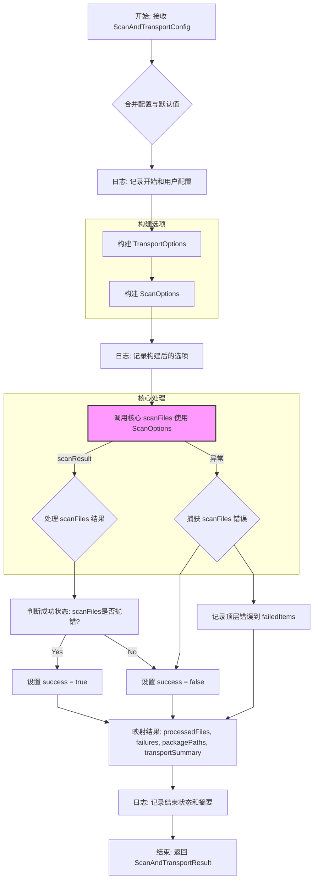
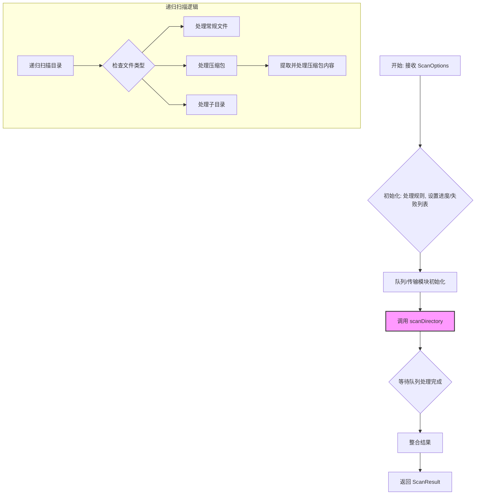
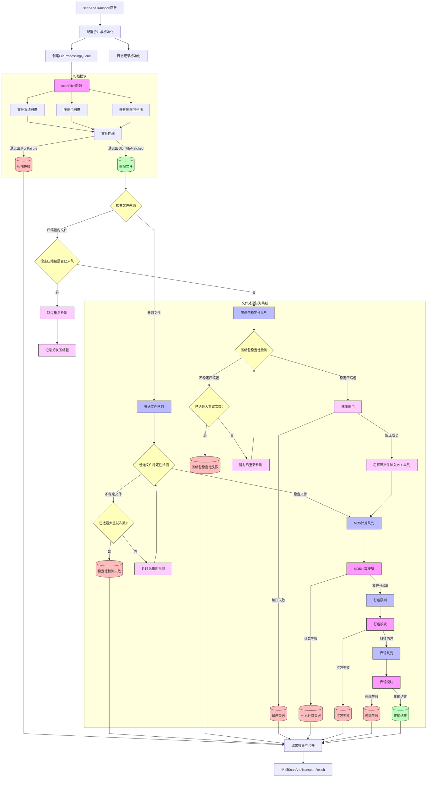

# `scanAndTransport` 函数概要设计

## 1. 引言与目标

为了简化常用文件处理流程，降低用户使用门槛，我们设计了一个新的高级封装函数 `scanAndTransport`。该函数旨在提供一个简洁的接口，用于执行核心的"扫描 -> 稳定性检测 -> MD5 计算 -> 打包 -> 传输"工作流。用户只需提供必要的配置，函数内部将处理大部分选项的默认值和流程编排，从而隐藏底层 `scanFiles` 函数的复杂性。

## 2. 函数签名

```typescript
import { MatchRule, ScanProgress, FileItem, FailureItem } from './types'; // 假设类型定义位置

// 定义简化版的 Transport 配置接口
interface ScanAndTransportTransportConfig {
  protocol: 'ftp' | 'sftp';
  host: string;
  port: number;
  username: string;
  password: string; // 注意：生产环境建议使用更安全的方式处理密码
  remotePath: string;
}

// 定义打包触发条件接口
interface PackagingTriggerOptions {
  /** 触发打包的文件数量阈值 */
  maxFiles: number;
  /** 触发打包的文件总大小阈值 (单位 MB) */
  maxSizeMB: number;
}

// 定义 scanAndTransport 配置接口
interface ScanAndTransportConfig {
  // --- 必需参数 ---
  /** 要扫描的根目录 */
  rootDir: string;
  /** 文件匹配规则 */
  rules: MatchRule[];
  /** 传输目标服务器基本信息 */
  transport: ScanAndTransportTransportConfig;

  // --- 可选参数 ---
  /** 本地临时存储打包文件的目录 (默认: './temp/packages') */
  outputDir?: string;
  /** 打包文件的命名模式 (默认: 'package_{date}_{index}') */
  packageNamePattern?: string;
  /** 进度回调函数，提供详细进度 */
  onProgress?: (progress: ScanProgress, matchedFile?: FileItem) => void;
  /** 最大扫描文件大小，单位字节 (默认: 500 * 1024 * 1024) */
  maxFileSize?: number;
  /** 需要跳过的目录列表 (默认: []) */
  skipDirs?: string[];
  /** 扫描深度, -1表示无限深度 (默认: -1) */
  depth?: number;
  /** 是否扫描嵌套压缩包 (默认: true) */
  scanNestedArchives?: boolean;
  /** 最大嵌套扫描层数 (默认: 5) */
  maxNestedLevel?: number;
  /** 打包触发条件 (默认: { maxFiles: 500, maxSizeMB: 2048 }) */
  packagingTrigger?: PackagingTriggerOptions;
  /** 日志文件路径 (默认: './scan_transport_log_{时间戳}.log') */
  logFilePath?: string;
}

// 定义 scanAndTransport 返回结果接口
interface ScanAndTransportResult {
  /** 整个过程是否基本成功 (即使有部分文件失败) */
  success: boolean;
  /** 成功处理并打包的文件列表 (包含MD5等元数据，用于下次跳过) */
  processedFiles: FileItem[];
  /** 整个流程中所有失败的条目列表 (包含路径和错误，用于重试) */
  failedItems: FailureItem[];
  /** 本地生成的包文件路径列表 */
  packagePaths: string[];
  /** 每个包的传输结果摘要 */
  transportSummary: any[]; // TODO: 定义更具体的 TransportResult 接口
  /** 实际使用的日志文件路径 */
  logFilePath: string;
}

/**
 * 执行扫描、打包和传输的简化流程函数
 * @param config 配置对象
 * @returns 包含处理结果和日志路径的对象
 */
async function scanAndTransport(config: ScanAndTransportConfig): Promise<ScanAndTransportResult>;
```

## 3. 内部逻辑概述

`scanAndTransport` 函数将执行以下操作：

1. **设置默认值：** 为 `ScanAndTransportConfig` 中未提供的可选参数应用预设的默认值（如 `outputDir`, `packageNamePattern`, `maxFileSize`, `skipDirs`, `depth`, `scanNestedArchives`, `maxNestedLevel`, `packagingTrigger`, `logFilePath` 等）。
2. **构建 `ScanOptions`：**
    * 启用内部处理流程：将 `calculateMd5` 和 `createPackage` 设置为 `true`。
    * 设置可靠的默认 `StabilityCheckOptions` 和 `QueueOptions`（例如启用稳定性检查和队列，设置合理的并发数和重试次数）。
    * 根据用户提供的简化 `transport` 配置和默认值（重试次数、超时等）构建完整的 `TransportOptions`。
    * 将用户提供的 `packagingTrigger` 或其默认值整合到配置中，传递给底层逻辑。
    * 将所有必需和可选配置组装成完整的 `ScanOptions` 对象。
3. **初始化日志：** 根据 `logFilePath`（用户指定或默认生成）设置日志记录器，将关键信息写入文件。
4. **调用核心功能：** 使用构建好的 `ScanOptions` 调用 `scanFiles` 函数。
5. **处理与整合结果：**
    * 监听 `scanFiles` 的 `onProgress` 回调（如果用户也提供了 `onProgress`，则进行包装转发）。
    * 处理 `scanFiles` 返回的 `ScanResult` 对象。
    * 将 `scanResult.processedFiles`（需要确认 `scanFiles` 返回此信息）提取为 `processedFiles`。
    * 整合 `scanResult.failures` 以及打包、传输阶段可能产生的错误到 `failedItems` 列表中。
    * 记录生成的 `packagePaths` 和 `transportResults`。
6. **记录日志：** 在整个执行过程中，将配置信息、关键阶段（扫描、打包、传输）的开始/结束、错误详情等写入日志文件。
7. **返回结果：** 构建并返回 `ScanAndTransportResult` 对象。

## 4. 与 `scanFiles` 的关系

`scanAndTransport` 是对底层 `scanFiles` 函数的一个高级封装（Facade）。它简化了常见用例的配置。对于需要更精细控制（例如，自定义队列行为、单独执行扫描而不传输等）的高级用户，仍然可以直接使用 `scanFiles` 函数及其完整的 `ScanOptions` 配置。

## 5. 优点

* **简化配置：** 用户只需关注核心需求。
* **易于使用：** 调用代码更简洁、直观。
* **默认最佳实践：** 内部默认启用稳定性、队列、MD5、打包等，并使用推荐设置。
* **结果清晰：** 返回明确的成功/失败文件列表和日志，方便后续处理。 




好的，我将为 `scanFiles` 函数绘制流程图和数据流向图。

请注意，`scanFiles` 函数内部逻辑相当复杂，特别是涉及递归扫描、嵌套压缩包处理和可选的异步队列处理（稳定性、MD5、打包、传输）。这些图表旨在展示其主要流程和数据交互，可能会简化一些细节。

**1. `scanFiles` 流程图 (Flowchart)**

此图展示了 `scanFiles` 的控制流程和主要步骤。



**2. `scanFiles` 数据流向图 (Data Flow Diagram)**


# 改造后的scanAndTransport数据流向图 (Mermaid)



## 数据流向说明

1. **初始配置** - 函数接收配置，初始化队列和日志系统

2. **扫描模块** - 改造后的`scanFiles`只负责:
   - 文件系统扫描
   - 压缩包扫描
   - 嵌套压缩包扫描
   - 文件匹配并通过回调函数输出

3. **队列系统** - 处理匹配到的文件:
   - 稳定性检测队列 → 稳定性检测模块
   - MD5计算队列 → MD5计算模块
   - 打包队列 → 打包模块
   - 传输队列 → 传输模块
   
4. **错误处理** - 各阶段的失败收集:
   - 扫描失败
   - 稳定性检测失败
   - MD5计算失败
   - 打包失败
   - 传输失败

5. **结果处理** - 收集和合并所有结果，返回最终结果

每个模块专注于自己的职责，通过队列系统实现文件处理的流水线，保持处理顺序的同时支持一定程度的并行执行。
