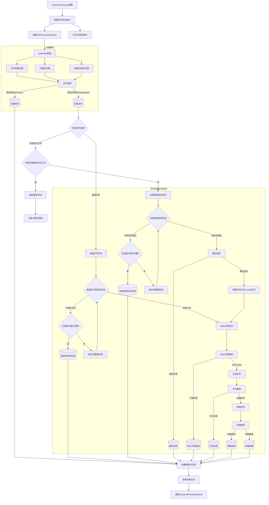

# scanFiles与scanAndTransport功能分离重构方案

## 背景

目前`scanFiles`函数职责过重，既包含文件扫描又包含稳定性检测、MD5计算、打包和传输等功能，造成以下问题：

1. 函数过于庞大（1100多行代码），难以维护和测试
2. 职责不单一，违反单一职责原则
3. 功能耦合度高，难以独立测试和复用
4. 代码结构复杂，难以理解和扩展

## 重构目标

1. `scanFiles`函数专注于文件扫描和匹配，返回匹配文件列表
2. `scanAndTransport`函数负责调度文件处理流程（稳定性检测、MD5计算、打包、传输）
3. 使用队列系统管理文件处理流程，支持并行处理
4. 改进压缩包处理逻辑，提高效率
5. 添加任务ID和扫描ID，支持结果持久化
6. 支持开始时间和结束时间统计

## 数据结构变化

### ScanOptions 接口

```typescript
// 更新前
export interface ScanOptions {
  rootDir: string;
  matchRules: MatchRule[];
  depth: number;
  onProgress?: (progress: ScanProgress, matchedFile?: FileItem) => void;
  maxFileSize?: number;
  skipDirs?: string[];
  scanNestedArchives?: boolean;
  maxNestedLevel?: number;
  stabilityCheck?: StabilityCheckOptions;
  queue?: QueueOptions;
  transport?: TransportOptions;
  calculateMd5?: boolean;
  createPackage?: boolean;
  packageNamePattern?: string;
  outputDir?: string;
  packagingTrigger?: PackagingTriggerOptions;
}

// 更新后
export interface ScanOptions {
  /** 扫描的根目录 */
  rootDir: string;
  /** 文件匹配规则列表 */
  matchRules: MatchRule[];
  /** 扫描深度，-1表示扫描到没有下级目录为止 */
  depth?: number;
  /** 最大文件大小（字节），超过此大小的文件将被忽略，默认 500MB */
  maxFileSize?: number;
  /** 要跳过的目录名列表（相对于扫描目录的路径） */
  skipDirs?: string[];
  /** 是否扫描嵌套压缩文件，默认为true */
  scanNestedArchives?: boolean;
  /** 最大嵌套层级，默认为5 */
  maxNestedLevel?: number;
  /** 任务唯一标识符 */
  taskId?: string;
  /** 基本进度回调函数 */
  onProgress?: (progress: ScanProgress) => void;
  /** 文件匹配回调函数 - 用于队列处理 */
  onFileMatched?: (file: FileItem, progress: ScanProgress) => void;
  /** 失败信息回调函数 - 用于队列处理 */
  onFailure?: (failure: FailureItem, progress: ScanProgress) => void;
}
```

### ScanResult 接口

```typescript
// 更新前
export interface ScanResult {
  /** 成功匹配的文件列表 */
  results: FileItem[];
  /** 扫描过程中发生的失败列表 */
  failures: FailureItem[];
  /** 处理的文件数据（添加MD5后） */
  processedFiles?: FileItem[];
  /** 创建的包文件列表 */
  packages?: string[];
  /** 传输结果 */
  transportResults?: {
    success: boolean;
    filePath: string;
    remotePath: string;
    error?: string;
  }[];
}

// 更新后
export interface ScanResult {
  /** 成功匹配的文件列表 */
  matchedFiles: FileItem[];
  /** 扫描过程中发生的失败列表 */
  failures: FailureItem[];
  /** 扫描统计信息 */
  stats: {
    totalScanned: number;
    totalMatched: number;
    totalFailures: number;
    archivesScanned: number;
    nestedArchivesScanned: number;
  };
  /** 任务唯一标识符 */
  taskId?: string;
  /** 扫描唯一标识符 */
  scanId: string;
  /** 扫描开始时间 */
  startTime: Date;
  /** 扫描结束时间 */
  endTime: Date;
  /** 扫描耗时（毫秒） */
  elapsedTimeMs: number;
}
```

### 新增接口 - QueueConfig

```typescript
/** 定义文件处理队列配置 */
export interface QueueConfig {
  /** 是否启用队列处理 (默认: true) */
  enabled?: boolean;
  /** 最大并发稳定性检测数量 (默认: 5) */
  maxConcurrentChecks?: number;
  /** 最大并发MD5计算数量 (默认: 5) */
  maxConcurrentMd5?: number;
  /** 最大并发传输数量 (默认: 2) */
  maxConcurrentTransfers?: number;
  /** 稳定性检测重试延迟（毫秒）(默认: 2000) */
  stabilityRetryDelay?: number;
  /** 最大稳定性检测重试次数 (默认: 3) */
  maxStabilityRetries?: number;
}
```

### 新增接口 - StabilityConfig

```typescript
/** 定义稳定性检测配置 */
export interface StabilityConfig {
  /** 是否启用稳定性检测 (默认: true) */
  enabled?: boolean;
  /** 检测间隔（毫秒）(默认: 500) */
  checkInterval?: number;
  /** 大文件阈值（字节）(默认: 100MB) */
  largeFileThreshold?: number;
  /** 是否对大文件跳过读取检测 (默认: true) */
  skipReadForLargeFiles?: boolean;
}
```

### 更新 ScanAndTransportConfig 接口

```typescript
export interface ScanAndTransportConfig {
  // --- 必需参数 ---
  /** 要扫描的根目录 */
  rootDir: string;
  /** 文件匹配规则 */
  rules: MatchRule[];
  /** 传输目标服务器基本信息 */
  transport: ScanAndTransportTransportConfig;
  /** 任务唯一标识符 */
  taskId: string;

  // --- 可选参数 ---
  /** 本地临时存储打包文件的目录 (默认: './temp/packages') */
  outputDir?: string;
  /** 打包文件的命名模式 (默认: 'package_{date}_{index}') */
  packageNamePattern?: string;
  /** 进度回调函数，提供详细进度 */
  onProgress?: (progress: ScanProgress, matchedFile?: FileItem) => void;
  /** 最大扫描文件大小，单位字节 (默认: 500 * 1024 * 1024) */
  maxFileSize?: number;
  /** 需要跳过的目录列表 (默认: []) */
  skipDirs?: string[];
  /** 扫描深度, -1表示无限深度 (默认: -1) */
  depth?: number;
  /** 是否扫描嵌套压缩包 (默认: true) */
  scanNestedArchives?: boolean;
  /** 最大嵌套扫描层数 (默认: 5) */
  maxNestedLevel?: number;
  /** 打包触发条件 (默认: { maxFiles: 500, maxSizeMB: 2048 }) */
  packagingTrigger?: PackagingTriggerOptions;
  /** 日志文件路径 (默认: './scan_transport_log_{时间戳}.log') */
  logFilePath?: string;
  /** 队列处理配置 */
  queue?: QueueConfig;
  /** 稳定性检测配置 */
  stability?: StabilityConfig;
  /** 是否计算MD5 (默认: true) */
  calculateMd5?: boolean;
  /** 结果文件存储目录 (默认: './results') */
  resultsDir?: string;
}
```

### 更新 ScanAndTransportResult 接口

```typescript
/** 定义 scanAndTransport 返回结果接口 */
export interface ScanAndTransportResult {
  /** 整个过程是否基本成功 (即使有部分文件失败) */
  success: boolean;
  /** 成功处理并打包的文件列表 (包含MD5等元数据，用于下次跳过) */
  processedFiles: FileItem[];
  /** 整个流程中所有失败的条目列表 (包含路径和错误，用于重试) */
  failedItems: FailureItem[];
  /** 本地生成的包文件路径列表 */
  packagePaths: string[];
  /** 每个包的传输结果摘要 */
  transportSummary: {
    success: boolean;
    filePath: string;
    remotePath: string;
    error?: string;
  }[];
  /** 实际使用的日志文件路径 */
  logFilePath: string;
  /** 任务唯一标识符 */
  taskId: string;
  /** 扫描唯一标识符 */
  scanId: string;
  /** 结果文件路径 */
  resultFilePath: string;
  /** 开始时间 */
  startTime: Date;
  /** 结束时间 */
  endTime: Date;
  /** 总耗时（毫秒） */
  elapsedTimeMs: number;
}
```

## 流程图

### 改造后的scanAndTransport数据流向图



## 模块划分

### 1. 核心模块

- **scanner.ts** - 文件扫描功能
- **stability.ts** - 文件稳定性检测
- **md5.ts** - MD5计算
- **packaging.ts** - 文件打包
- **transport.ts** - 文件传输
- **queue.ts** - 文件处理队列

### 2. 外观模块

- **facade.ts** - 集成上述功能的高级API

## 改造实施计划

### 阶段1: 准备工作 (2天)

1. 备份当前代码
2. 更新类型定义
   - 修改 `ScanOptions` 和 `ScanResult` 接口
   - 添加 `QueueConfig` 和 `StabilityConfig` 接口
   - 更新 `ScanAndTransportConfig` 和 `ScanAndTransportResult` 接口
3. 确保每个独立模块都有足够的单元测试覆盖

### 阶段2: scanFiles函数简化 (3天)

1. 移除 `scanFiles` 中的稳定性检测代码
2. 移除 MD5计算代码
3. 移除打包功能代码
4. 移除传输功能代码
5. 移除队列处理代码
6. 添加新的回调接口支持
7. 添加时间记录功能
8. 修改返回值结构

### 阶段3: 队列系统实现 (2天)

1. 强化 `FileProcessingQueue` 类
2. 添加文件来源检测逻辑
3. 实现压缩包特殊处理逻辑
4. 添加重试次数限制机制
5. 完成队列之间的流转逻辑

### 阶段4: scanAndTransport重构 (3天)

1. 实现基于队列的文件处理流程
2. 添加任务ID和扫描ID支持
3. 实现结果文件保存功能
4. 添加开始时间和结束时间记录
5. 实现完整的错误处理和恢复机制

### 阶段5: 测试与优化 (2天)

1. 编写集成测试确保功能完整性
2. 性能测试和优化
3. 边界情况测试
4. 文档更新

### 阶段6: 部署与监控 (1天)

1. 灰度发布
2. 监控关键指标
3. 收集用户反馈

## 风险与对策

| 风险 | 可能性 | 影响 | 对策 |
|------|-------|------|------|
| 重构引入新bug | 中 | 高 | 完善测试用例，保持现有功能完整性 |
| 性能下降 | 低 | 中 | 性能测试和针对性优化 |
| 修改导致API不兼容 | 中 | 高 | 保持公共API一致，提供兼容层 |
| 队列处理复杂度高 | 高 | 中 | 清晰的错误处理，完善的日志 |

## 预期收益

1. 代码组织更清晰，职责单一，更易维护
2. 支持并行处理提高效率
3. 减少内存占用峰值
4. 更好的错误处理和恢复能力
5. 完整的进度追踪和任务管理
6. 更灵活的配置选项

## 结论

通过将`scanFiles`功能分离，我们可以显著提高代码质量和系统性能。重构后的代码结构将更符合单一职责原则，更易于维护和扩展。使用队列系统管理文件处理流程，可以更高效地利用系统资源，提供更好的用户体验。 