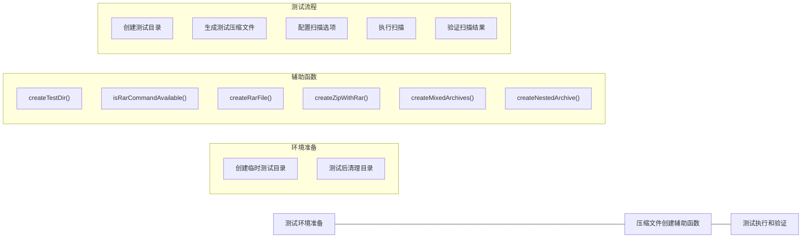
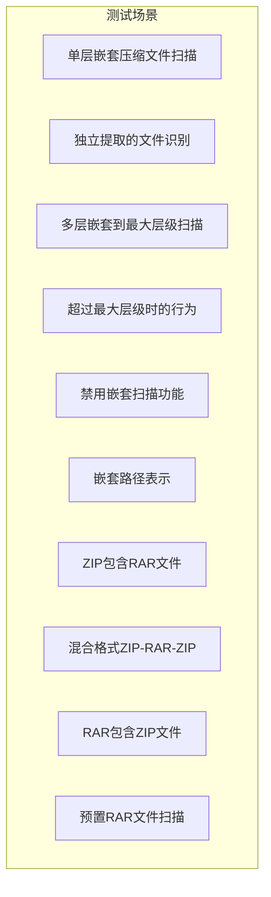
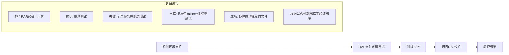

# 嵌套压缩文件扫描测试逻辑分析

测试代码主要测试一个能够扫描嵌套压缩文件的功能，重点是验证对各种压缩格式(ZIP、RAR)和嵌套情况的处理能力。

## 测试流程图

## 主要测试场景

## 错误处理流程

测试中即使处理RAR压缩包出错，测试也能通过的原因是测试用例根据不同的支持情况设计了不同的期望结果。例如，对于RAR文件处理，测试会先检查文件是否成功被处理，如果处理成功，才会进一步验证嵌套内容；如果处理失败，测试会记录失败但不会要求测试失败，因为这可能只是环境限制（如未安装RAR工具）。
